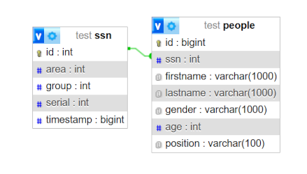
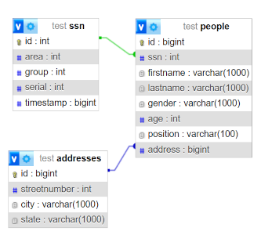
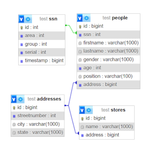
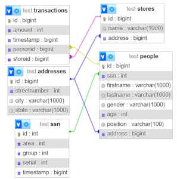

# Foreign Keys
Alright, this feature took a bit to make and it has some quirks to it that will be worked out eventually, however it works, and I am pretty happy I got this to work without having to save any data to a meta table as I was worried about.  
This allows you to link data to and from another table. This library only supports One-To-One, One-To-Many and Many-To-One structures and not Many-To-Many with this system.  
However, another drawback with this implementation is that there is some repeated data and seemingly irrelevant data being passed into annotations, I assure you that it was necessary to support it and not rely on things that aren't concrete at run-time.  

## One-To-One Relationship
A 1-to-1 relationship is where 1 object is directly related to 1 other object. However, this library only supports this in a one-way direction, so you need to choose which class is the primary holder of the relationship. There are plans to change this by using different annotations, but this is not the case for now.  
Lets define a `SSN` class for a social security number
```java
public class SSN {
    private int id;
    private int area, group, serial;
    private long timestamp;
    
    private SSN() {}

    //All args constructor (Except for ID)
    //Getters
    //IntelliJ IDEA Generated toString method
}
```
Just like in previous cases, the `id` field is entirely internal.  
USA SSNs use this structure, as I am American, this is what I am familiar with, I have also written a generator to generate numbers. Just random, shouldn't match anything other than digit counts.  

Then, I just add a field to the `Person` class as that is the one that I want to hold the Foreign Key, and add the `@ForeignKey` annotation and providing the `SSN.class`
```java
@ForeignKey(SSN.class)
protected SSN ssn;
```
And just make sure that I register the SSN class before I register the Person class and we are good to go, running this, I get the following table structure (For just these two)  
  
The designer allows us to see a link between the SSN ID and the ssn column in Person.  

You may be asking, what is the purpose? Well, it is around keeping data up to date and making sure we have data integrity as trying to delete or update the ID of the person will cause an error, we can customize that with more annotations, but I will be covering that use case in another relationship type.  

## One-To-Many and Many-To-One Relationships
These relationships are pretty neat and are interchangeable, however to use it with this library, there are some things that are a bit weird.  
We will have two examples of this, one is with addresses and one is with the transactions. The Addresses one will be pretty simple.  
Instead of ignoring the address field in person, we just add a `@ForeignKey` tag to it with the `Address.class` as the parameter.  
```java
@ForeignKey(Address.class)
protected Address address;
```
Then we just regenerate our tables and we get the below structure.  
  
Since we are working with the address class again, lets at a One-to-One relationship between an address and the store class, we can do that by using the same annotation for the store address  
```java
@ForeignKey(Address.class)
protected Address address;
```
Regenerating the tables gets us this   
  
As you can see, the relationships are getting there, and really helps us use the full effect of relational databases like SQL.  

Lets talk about that transactions example, this one is a bit more complicated as the above is a One-To-Many or a One-To-One.  

This library allows you to use collections as a way to do a Many-To-One relationship, however, to prevent recursive loading, only one side can have the full instance.  
For the transactions, I am going to store the storeid and the personid as integer fields, but have a foreign key to the respective classes and use the `@ForeignKeyStorage` annotation to tell the library to load values based on annotation parameters.  
Lets start with adding the Annotations to the Person and Store classes  
In the Person class
```java
@ForeignKeyStorage(clazz = Transaction.class, field = "personid")
protected List<Transaction> transactions = new ArrayList<>();
```  
And in the Store class
```java
@ForeignKeyStorage(clazz = Transaction.class, field = "storeid")
protected List<Transaction> transactions = new ArrayList<>();
```
So the parameters of this annotation are the class that foreign key is referencing and the field in that class that stores the id to filter by.  

Then in the Transaction class, we do the following to those two fields  
```java
@ForeignKey(Person.class)
private long personid;

@ForeignKey(Store.class)
private long storeid;
```
The fields for the ids must match the types, otherwise an error will be thrown when the class is registered.  
  

## On Update and On Delete Actions
The library also allows you to customize what happens when updates and deletes occur on a foreign key.  
The Actions are `NO_ACTION`, `CASCADE`, `RESTRICT`, `SET_NULL`. The default is `RESTRICT` for most SQL implementations, so that is the default that the libary assumes.  
You can provide this with the `@FKOnDelete` and `@FKOnUpdate` annotations.  
I am going to add `@FKOnDelete(FKAction.SET_NULL)` to all of my `@ForeignKey` fields because I don't want to remove any other data, however, there are some use cases where cascade is useful.  
These do not get applied to the Storage annotations though, just the fields with the main one