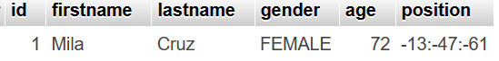

---
hide:
  - toc
---

# ObjectCodecs
Object codes allow you to override the default behavior for a specific field. This allows you to really customize things based on your need.  
For global handling of types, please see [TypeHandlers](au-typehandlers.md) for more information.  

Both this page and the TypeHandlers page will be around doing the `Position` class.  

## Defining an implementation
First, create a class that implements the `ObjectCodec` interface and just generate empty methods for now  
```java
public class PositionCodec implements ObjectCodec<Position> {
    @Override
    public String encode(Object o) {
        return null;
    }

    @Override
    public Position decode(String s) {
        return null;
    }
}
```
Ensure that there is a default no-args constructor, the library will create instances of this class as needed.  

## Implementing the methods
Then you just want to handle how you want things to be formatted as a String. Please note: The Object passed into the `encode` method is safe to cast without checking, this is just a limitation of interactions between generics and Java Reflection that it needs to be an Object.  
As for `decode`, the String will never be null or empty when passed in.  
```java
public class PositionCodec implements ObjectCodec<Position> {
    @Override
    public String encode(Object o) {
        Position pos = (Position) o;
        return pos.getX() + ":" + pos.getY() + ":" + pos.getZ();
    }

    @Override
    public Position decode(String s) {
        String[] split = s.split(":");
        if (split.length == 3) {
            return new Position(Integer.parseInt(split[0]), Integer.parseInt(split[1]), Integer.parseInt(split[2]));
        }
        return null;
    }
}
```

Note: You should be doing better checks and catching `NumberFormatException`. This is just an example, therefore, extra checks are not done.  

## Telling the library to use it using the Annotation
Then, for every field (only one in this example) you want, just do the following
```java
@Codec(PositionCodec.class)
protected Position position;
```

Please note, you can customize the length of the varchar type, but this is covered in a later page.  

## Database Results
Now, we not only get a column for the position, unlike in the preamble, but we also get it saving and loading as well.  


