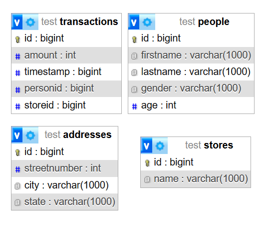

---
hide:
  - toc
---

# Advanced Usage Preamble
Please make sure you understand the [basic usage](basicusage.md) of this library first before getting into the advanced stuff.  
Everything from that page applies here, so same database type, same basic structure and same thing about random data, that stuff is outside of the scope of this tutorial.  

As a general warning, in no way is the examples practical, and they are just provided as a BASIC example of modeling data, you must come up with your own structure.  

## Address Class
```java
@Name("addresses")
public class Address {
    private long id;
    private int streetNumber;
    private String city;
    private String state;

    private Address() {}
    
    //All args constructor (Except ID)
    //Getters and Setters
    //IntelliJ IDEA Generated toString method
}
```

## Transaction Class
```java
@Name("transactions")
public class Transaction {
    private long id;
    private int amount;
    private long timestamp;

    private long personid;

    private long storeid;

    private Transaction() {}
    
    //Constructor that takes in an amount and timstamp
    //All args constructor (Except ID)
    //Getters and Setters
    //IntelliJ IDEA Generated toString method
}
```

## Store Class
```java
@Name("stores")
public class Store {
    private long id;
    private String name;

    private Address address;

    private List<Transaction> transactions = new ArrayList<>();

    private Store() {}
    
    //Constructor that takes in a name and address
    //Getters and setters
    //IntelliJ IDEA generated toString method
}
```

## Position Class
```java
public class Position {
    private int x, y, z;
    
    //All args constructor
    //IntelliJ IDEA generated toString method
}
```

## Person Class
```java
@Name("people")
public class Person {
    protected long id;
    protected String firstName;
    protected String lastName;
    protected Gender gender;
    protected int age;
    protected Position position;

    protected Address address;

    protected List<Transaction> transactions = new ArrayList<>();

    protected Person() {
    }

    public Person(String firstName, String lastName, Gender gender, Address address, int age, Position position) {
        this.firstName = firstName;
        this.lastName = lastName;
        this.gender = gender;
        this.address = address;
        this.age = age;
        this.position = position;
    }
    
    //All args constructor (Except for ID)
    //Getters and setters
    //IntelliJ IDEA generated toString method
}
```

## Database Registration
```java
database.registerClass(Address.class);
database.registerClass(Person.class);
database.registerClass(Store.class);
database.registerClass(Transaction.class);
```

Because of the lack of actual configuration, it doesnt matter right now, as it wont work anyways if you try to run this as is

## Next Steps
Please continue on, this is just the basic structure that we will be using. I recommend going to [ObjectCodecs](au-objectcodec.md) or [TypeHandlers](au-typehandlers.md)
However, if you want to see the structure, you can use the `@Ignored` annotation on the fields with type `Address`, `List<Transaction>` and `Position`.  
The image below is generated from the PHPMyAdmin Designer Tab and is pretty useful for viewing structures of tables
