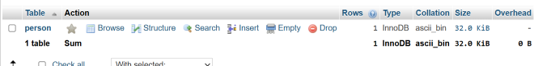
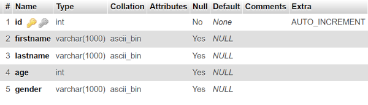
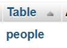
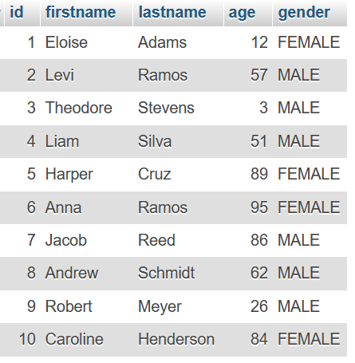

---
hide:
  - navigation
---

# Basic Example
This is a continuation of the [initial setup](initialsetup.md), under a far more basic usage of the library.  

## Some Setup
So, in order for us to work with data, we need a data structure. SQL uses Tables to organize data, lucky for us, in an Object Orientated Programming Language, this is easy to work with and map.  
For the purposes of this tutorial, all data is made up or randomly generated, the code to actually do the generation is not going to be shown nor is it within the scope of this tutorial.  
Just for reference, I have text files for the male first names, female first names and last names that I am loading into an array.  
Also, I am in full support of non-binary gender identity. The `Male-Female` gender model is for simplicity in this tutorial, otherwise it would be far longer than I would need it to be.  

## Gender Enum
StarSQL Supports Enums, so here is a basic one that I will be using
```java
public enum Gender {
    MALE, FEMALE
}
```
Please see note above about this enum, it is for simplicity and nothing more.  

## Person class
The class to represent a person
```java
public class Person {
    private int id;
    private String firstName;
    private String lastName;
    private int age;
    private Gender gender;

    private Person() {}
    
    //All args constructor
    //Getters and Setters for everything, no setter for "id"
}
```
The ID field will be automatically detected as an auto-increment field in the table when it is generated.  
The no-args constructor is important, as this allows the library to create instances as it pleases, without having to do anything really weird. This can be private and still work.

## Registering the class to the database
Now that we have the class, we need to register it to the database
This must be done either before the database is registered to the registry (If the setup method has been called), or before the setup method is called on the registry  
I am calling it before both just because it looks cleaner
```java
SQLDatabase database = new MySQLDatabase(LOGGER, properties);
database.registerClass(Person.class); //REGISTER CLASS TO DATABASE
registry.register(database);
registry.setup();
```

Now if run this, it will generate the table, and in PHPMyAdmin, my tables look like this
  
And if we look at the structure  
  
We can see there is some things there that the library did for us. 

If you notice, the table name, and column names come from the class name and the field names respectively.  
However, you may want to use the plural version of a name for tables, for that, we have the `@Name` annotation that we can put on both classes and fields.  
```java
@Name("people")
public class Person {
 //other stuff
}
```
Now, if we drop the table and let it regenerate...   
  
We aren't going to cover other forms of primary key/id and will just use the integer auto-increment ids for the basic tutorial, the Advanced one will cover that. 

Now, lets generate and save some data to the database.  

## Saving Data
To save data, there are two methods, `save` and `saveSilent`. They are identical except the `saveSilent` catches and silences the exceptions if there are any.  
```java
for (int i = 0; i < 10; i++) {
    Gender gender = randomGender();
    database.saveSilent(new Person(randomFirstName(gender), randomLastName(), randomAge(), gender));
}
```
The randomXXX methods are not important, these are helper methods that I created because I am using text files for names.  

Now if I run this, I get some random data to work with.   


## Retrieving Data
Getting data is also pretty easy, however to make it easier to print to the console, lets create a toString method using IntelliJ IDEA
```java
public String toString() {
        return "Person{" +
                "id=" + id +
                ", firstName='" + firstName + '\'' +
                ", lastName='" + lastName + '\'' +
                ", age=" + age +
                ", gender=" + gender +
                '}';
    }
```

This will allow us to verify that the data is the same.  

```java
List<Person> people = database.get(Person.class);
people.forEach(person -> System.out.println(person.toString()));
```

The `get` method ALWAYS returns a List. This is never null. And it does have a checked exception
Output is as follows 
```text
Person{id=1, firstName='Eloise', lastName='Adams', age=12, gender=FEMALE}
Person{id=2, firstName='Levi', lastName='Ramos', age=57, gender=MALE}
Person{id=3, firstName='Theodore', lastName='Stevens', age=3, gender=MALE}
Person{id=4, firstName='Liam', lastName='Silva', age=51, gender=MALE}
Person{id=5, firstName='Harper', lastName='Cruz', age=89, gender=FEMALE}
Person{id=6, firstName='Anna', lastName='Ramos', age=95, gender=FEMALE}
Person{id=7, firstName='Jacob', lastName='Reed', age=86, gender=MALE}
Person{id=8, firstName='Andrew', lastName='Schmidt', age=62, gender=MALE}
Person{id=9, firstName='Robert', lastName='Meyer', age=26, gender=MALE}
Person{id=10, firstName='Caroline', lastName='Henderson', age=84, gender=FEMALE}
```

You can compare the data and see that they are the same between the ones in the database, and what we got as an output from the code.  

## Filtering Data
We can filter data by using the overload methods for the `get` method. There are two that are fine to use. the one taking in a String and an Object. The string is the column or field name, and the object is the value.  

### Single Column Filter
We can use any of the columns, I am going to pick something that I know has one piece of data
```java
List<Person> people = database.get(Person.class, "lastName", "Reed");
people.forEach(person -> System.out.println(person.toString()));
```
This is our output then
```text
Person{id=7, firstName='Jacob', lastName='Reed', age=86, gender=MALE}
```

What about doing it on the gender?
```java
List<Person> people = database.get(Person.class, "gender", Gender.FEMALE);
people.forEach(person -> System.out.println(person.toString()));
```
And the output is: 
```text
Person{id=1, firstName='Eloise', lastName='Adams', age=12, gender=FEMALE}
Person{id=5, firstName='Harper', lastName='Cruz', age=89, gender=FEMALE}
Person{id=6, firstName='Anna', lastName='Ramos', age=95, gender=FEMALE}
Person{id=10, firstName='Caroline', lastName='Henderson', age=84, gender=FEMALE}
```

Pretty neat huh?  

What about filtering with multiple columns? Well, we need to get into the WhereClause then

### Filtering with the WhereClause class
This class is a wrapper class for the Where SQL clause.  
I made wrappers for the sql statements that are used within this library to make this easier on myself, and have the benefit of allowing this level of control.  
Lets say, we want to get all males above the age of 25
```java
WhereClause whereClause = new WhereClause();
whereClause.addCondition("gender", "=", Gender.MALE);
whereClause.addCondition(WhereOperator.AND, "age", ">", 25);
List<Person> people = database.get(Person.class, whereClause);
people.forEach(person -> System.out.println(person.toString()));
```
We get the output 
```text
Person{id=2, firstName='Levi', lastName='Ramos', age=57, gender=MALE}
Person{id=4, firstName='Liam', lastName='Silva', age=51, gender=MALE}
Person{id=7, firstName='Jacob', lastName='Reed', age=86, gender=MALE}
Person{id=8, firstName='Andrew', lastName='Schmidt', age=62, gender=MALE}
Person{id=9, firstName='Robert', lastName='Meyer', age=26, gender=MALE}
```
When using the the WhereClause, you must specify a WhereOperator on all of the ones AFTER the first one, otherwise, it doesn't know what you want to do for it.  


## Updating Exisitng Data
Another good feature is the ability to update existing data, lets update the ages of all of them to be a year higher
```java
List<Person> people = database.get(Person.class);
people.forEach(person -> {
    person.setAge(person.getAge() + 1);
    database.saveSilent(person);
});
List<Person> peopleUpdated = database.get(Person.class);
peopleUpdated.forEach(person -> System.out.println(person.toString()));
```
I am getting the data a second time to show that the data I have is from the database and not from memory
```text
Person{id=1, firstName='Eloise', lastName='Adams', age=13, gender=FEMALE}
Person{id=2, firstName='Levi', lastName='Ramos', age=58, gender=MALE}
Person{id=3, firstName='Theodore', lastName='Stevens', age=4, gender=MALE}
Person{id=4, firstName='Liam', lastName='Silva', age=52, gender=MALE}
Person{id=5, firstName='Harper', lastName='Cruz', age=90, gender=FEMALE}
Person{id=6, firstName='Anna', lastName='Ramos', age=96, gender=FEMALE}
Person{id=7, firstName='Jacob', lastName='Reed', age=87, gender=MALE}
Person{id=8, firstName='Andrew', lastName='Schmidt', age=63, gender=MALE}
Person{id=9, firstName='Robert', lastName='Meyer', age=27, gender=MALE}
Person{id=10, firstName='Caroline', lastName='Henderson', age=85, gender=FEMALE}
```

## Conclusion
That is about going to cover it for the basic tutorial. The Advanced Tutorial will cover a bit more. You can have as many tables and databases as you want under the basic usage, I just showed one to keep it simple.  